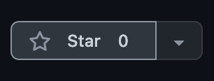

# Hola Mundo DApp 👋 
### Desarrollo de Blockchain de Pila Completa en Español ✨

### English Version: [Hello World DApp](https://github.com/dayana0425/hola-mundo-polygon-y-elgraph)


<p> Un proyecto de cajón y una guía para comenzar a construir rápidamente con Polygon y The Graph. Ideal para hackatones.

Aprende a hacer lo siguiente:
* Crear, compilar y desplegar un contrato inteligente en la red de prueba de Polygon Mumbai usando Hardhat.
* Verificar su contrato inteligente usando la API de Polygonscan.
* Interactuar con su contrato inteligente implementado desde su front-end usando Wagmi React Hooks.
* Utilizar Web3Storage para almacenar imágenes y datos de usuario.
* Crear, compilar e implementar un Subgraph en el servicio alojado de The Graph. (The Graph's Hosted Service)
* Consultar/Query su Subgraph desde su front-end usando GraphQL para mostrar datos de blockchain e ipfs.
* Aprenda a buscar, filtrar y ordenar sus datos usando The Graph.
</p>

[Diapositivas de Presentación](https://www.canva.com/design/DAFOY1CU5uM/WO7gJmknXlaF4YmR6e9l3A/view?website#2)

[Subgraph](https://thegraph.com/hosted-service/subgraph/dayana0425/holamundosubgraph)

[Contrato Inteligente](https://mumbai.polygonscan.com/address/0xa94F1Cc522A736C048A09B915633bE594D8DF914)

[Interfaz](https://hola-mundo-polygon-y-elgraph-next-app.vercel.app/)

# 🤖 Stack De Tech e Información De Cadena

#### Stack De Tech utilizado: 
 - Javascript
 - Next.js
 - Tailwind CSS 
 - Chakra UI
 - Rainbow Wallet
 - IPFS / Web3 Storage
 - The Graph
 - GraphQL
 - WAGMI
 - Hardhat
 - Ethers.js
#### Red de Blockchain: 
 - Polygon Mumbai: https://mumbai.polygonscan.com/
 #### Otras Características: 
 - Monorepo
  
 ---
# 🏄‍♂️ Inicio Rápido Para Ejecutar Localmente
#### Antes de clonar este proyecto, asegúrate de tener instalado lo siguiente en tu máquina (en este orden)!
* [Node.js](https://nodejs.org/en/) 
* [Yarn](https://classic.yarnpkg.com/en/docs/install/)
* [Git](https://git-scm.com/downloads)

#### Puedes verificar ejecutando estos comandos en tu terminal para revisar si ya los tienes instalados:

```bash
node -v
npm -v
yarn -v
git --version
```

> Si alguno no devuelve la información de la versión, debe instalarlos para asegurarse de que su máquina cumpla con los requisitos previos.
#### Fork y clonar este proyecto
* Primero, `Fork` este proyecto haciendo clic en el botón de `Fork` en la esquina superior derecha de la página del repositorio.

* Segundo, abre tu terminal y ejecuta el siguiente comando con tu usuario de github.
  
```bash
git clone https://github.com/<TU-USUARIO>/hola-mundo-polygon-y-elgraph
```
#### Instala todas las dependencias del proyecto

* En el directorio raíz instala las dependencias del proyecto ejecutando `yarn install`

```bash
cd hola-mundo-polygon-y-elgraph
yarn install
```
---

# 🛠 Configuración de Entorno y Wallet

#### Crea una wallet de desarollo con Metamask, una cuenta de Alchemy, de Web3Storage y de PolygonScan
* [Metamask](https://metamask.io/) 
   * IMPORTANTE: se recomienda crear una wallet solamente para desarrollo, ¡evita usar tu wallet normal!
   * Guarda la frase semilla (mnemotécnica) de esta wallet de desarrollo en tus notas. 
* [Alchemy](https://www.alchemy.com/)
  * Genera una clave api GRATIS para mumbai.
  * Guarda tu clave en tus notas.
* [PolygonScan](https://polygonscan.com/apis)
  * Genera una clave api GRATIS.
  * Guarda tu clave en tus notas.
* [Web3Storage](https://web3.storage/)
  * Genera una clave api GRATIS.
  * Guarda tu clave en tus notas.
  
> **¿Porque se necessita claves de API?**
> Una clave API es una combinación única de letras y números que autoriza a nuestro proyecto a realizar solicitudes al servicio que queremos usar, como Alchemy, Polygonscan y Web3Storage. Es una llave para desbloquear el acceso. ✨

#### Agrega las redes Testnet para Polygon Mumbai en Metamask:
* Cómo agregar Polygon Mumbai Testnet en Metamask: https://docs.polygon.technology/docs/develop/metamask/config-polygon-on-metamask/

> **¿Que es una <i>red de prueba</i>?**
> Usar Polygon Mainnet cuesta dinero real, pero existen Redes de Prueba o 'Testnets' como Polygon Mumbai que los desarrolladores usan para probar sus contratos inteligentes y cuesta dinero falso (dinero de prueba). Todas los Blockchains tienen sus propias redes de prueba.

#### Fondea tu Cuenta con MATIC de prueba:
* [Polygon Faucet (Mumbai Network)](https://faucet.polygon.technology/)

> **¿Que es un <i>Faucet?</i>?**
> Un 'Faucet' es un lugar donde puedes solicitar dinero de prueba para probar tu contrato inteligente. Hay límites sobre cuánto puedes recibir diariamente.

#### Configurar Variables de Entorno:

```bash
# navegue a la carpeta 'hardhat'
cd packages/hardhat 
# copie el contenido dentro de .env.example a .env
cp .env.example .env

# navegue a la carpeta 'next-app'
cd packages/next-app
# copie el contenido dentro de .env.example a .env
cp .env.example .env
```
* Complete los variables dentro de `.env` usando sus claves, URLs y frase inicial que guardó durante los pasos anteriores.

> **¿Por qué necesitamos establecer variables de entorno?**
> En nuestro archivo `.env` es donde almacenaremos las claves API, las direcciones URL y la frase inicial que usará nuestra DApp. Es una buena práctica no exponer estos valores en nuestro código y almacenarlos en un archivo que estará oculto. De esa manera, cuando ingresemos a GitHub, nuestras cuentas con dinero falso no se agotarán. (Los hackers drenan cuentas en Testnet tambien. 🙃)

---

# 📱 Ejecutar frontend en localhost

* En la misma ventana, ejecutar el comando `yarn dev`

```bash
yarn dev
```
* Abre http://localhost:3000 para ver la interfaz de la aplicación!

---

# 🚀 Despliega tu front-end en Vercel!
[Clic Para Desplegar](https://vercel.com/new?utm_source=create-next-app&utm_medium=default-template&utm_campaign=create-next-app)

---

# ❓ Necesitas ayuda?
* Mándame un mensaje por twitter o telegram: @hello_dayana
* Abre un Github Issue

---

# 📚 Recursos Para Desarrollo
30 Dias De Web3: 
https://www.30daysofweb3.xyz/es/curriculum/1-introducci%C3%B3n/0-bienvenidos
<br/>
Documentación de Solidity: 
https://docs.soliditylang.org/en/v0.8.15/
<br/>
Tutorial de Solidity: Crypto Zombies
https://cryptozombies.io/es/course
<br/>
Documentación de Next.js: 
https://nextjs.org/docs
<br/>
Documentación de Tailwind CSS: https://tailwindcss.com/docs/installation
<br/>
Documentación de Chakra-UI: https://chakra-ui.com/
<br/>
Chakra Templates: https://chakra-templates.dev/
<br/>
Documentación de Hardhat: https://hardhat.org/getting-started/
<br/>
Documentación de Ethers.js: https://docs.ethers.io/v5/
<br/>
Documentación de Rainbow Kit: https://www.rainbowkit.com/docs/introduction 
<br/>
Documentación de Wagmi: https://wagmi.sh/docs/getting-started
<br/>
Markdown Cheatsheet: 
https://www.markdownguide.org/cheat-sheet/
<br/>
El Libro de Git (Español):
https://git-scm.com/book/es/v2
<br/>
Atlassian Git Guru:
https://www.atlassian.com/git/tutorials
<br/> Git Comandos Cheatsheet:
https://www.hostinger.com/tutorials/basic-git-commands
</br>
Visual Studio Code:
https://code.visualstudio.com/
<br/>
Dev Setup for Mac:
https://www.youtube.com/watch?v=KwYqtbSwnH8
<br/>
# 📚 Herramientas Para Hackatones
Canva: Para Crear Presentaciones De Pitch Deck
https://www.canva.com/
</br>
Miro: Para planificar tu DApp:
https://miro.com/
</br>
Figma: Wireframes:
https://www.figma.com/
</br>
Notion: Para compartir archivos y colaborar con tu equipo:
https://www.notion.so/
</br>
Plantilla de Notion para hackatones (De: Women in Web3):
https://womeninweb3.notion.site/womeninweb3/Mini-Hack-Community-Template-65e5ee56505a49ec8c0a884ca4c63be0
<br/>
Web3athon Notion:
https://project-cradl.notion.site/Welcome-to-Web3athon-e0b17fe0a41b441fb33e6154adb5795e
<br/>

---

# ⭐️ Si te ha gustado este proyecto, ¡dale una estrella!


---

# 🚀 WAGMI
