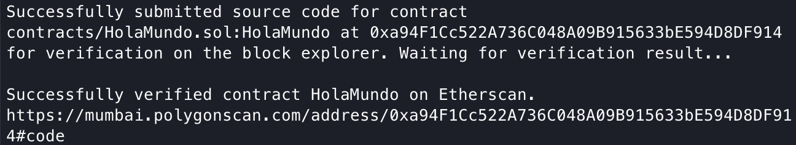

### COMANDOS - Ejecutar desde el directorio raíz.
#### Antes de implementar sus contratos inteligentes, debe compilar:
```
yarn compile
```
#### Implementar en la red de prueba de Polygon Mumbai:
```
yarn deploy
```

### [Verifique el contrato inteligente en Polygonscan usando Hardhat](https://coinsbench.com/verify-smart-contract-on-polygonscan-using-hardhat-9b8331dbd888)

```
cd packages/hardhat
yarn hardhat verify <DIRECCION DEL CONTRATO> --network mumbai
```
#### Deberías obtener esta salida:
