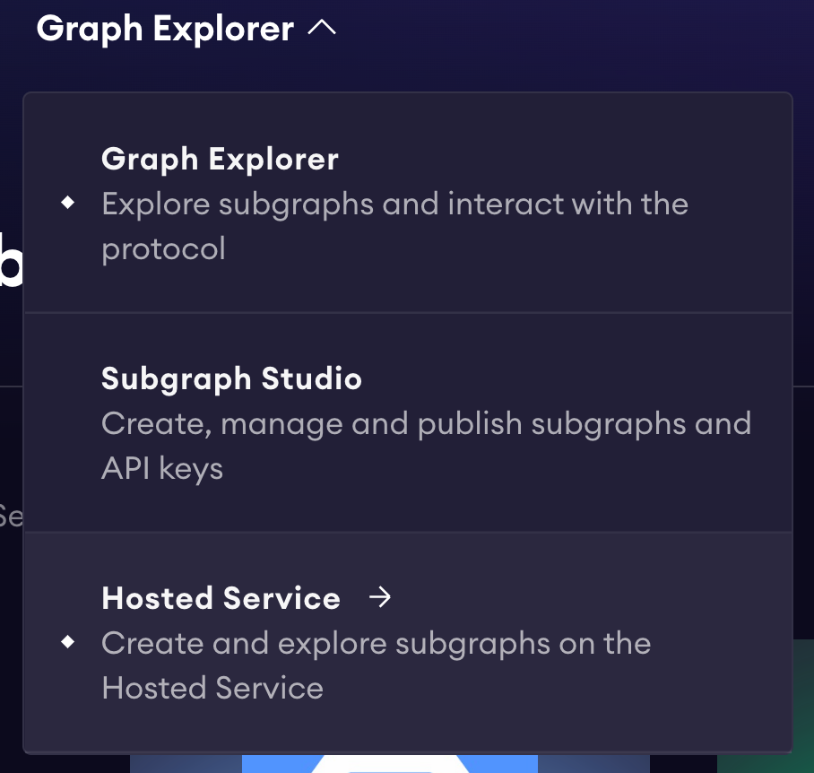
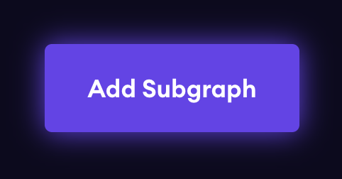
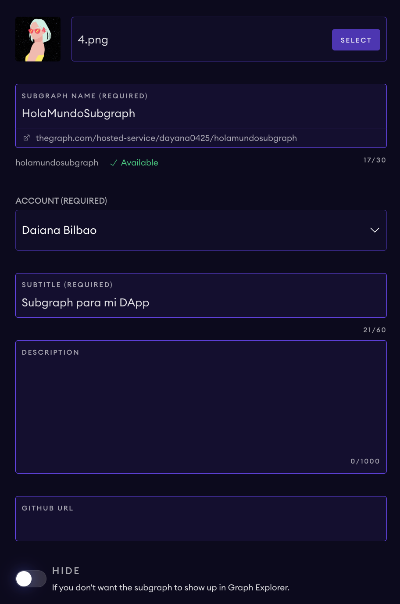

### COMANDOS - Ejecutar desde el directorio raíz.

```
subgraph:codegen
subgraph:build
subgraph:deploy
subgraph:create-local
subgraph:remove-local
subgraph:deploy-local
subgraph:test
```

### Cómo Utilizar:
Genera los Types de AssemblyScript para los ABIs y el esquema de Subgraph.
```
subgraph:codegen
```
Compila un Subgraph en WebAssembly.
```
subgraph:build
```
Implementa un Subgraph en un nodo de El Graph. Ejecute este comando una vez que haya terminado de hacer cambios.
```
subgraph:deploy
```

### Para Crear Un Nuevo Subgraph
Si implementó un nuevo contrato inteligente y desea crear un subgráfico para él. Es más fácil crear un NUEVO Subgraph que modificar este. Aquí están los pasos:

1. Vaya a https://thegraph.com/explorer
2. Seleccione el Servicio alojado / 'Hosted Service' en el menú:
   
3. Conéctate a Github.
   
4. Luego haga clic en la hamburguesa junto al icono de Github. Verás un menú. Ahora, haga clic en 'My Dashboard'
5. Luego haga clic en 'Add Subgraph'
   
6. Luego deberá completar un formulario donde deberá proporcionar un Nombre y Subtítulo para tu Subgraph
   
7. ¡Listo! Ahora, tendremos que hacer algunas configuraciones desde nuestra terminal.
8. Instale Graph CLI globalmente usando Yarn para que pueda construir e implementar Subgraphs
```
yarn global add @graphprotocol/graph-cli
```
9. Ejecute este comando en el directorio raíz.
```
graph init --product hosted-service <GITHUB_USUARIO>/<SUBGRAPH NOMBRE>
```
10. Ahora se le solicitarán varias opciones para su subgraph. Agregue sus preferencias, pero asegúrese de que su protocolo y red sean los mismos.
    * Protocol:
      * Ethereum
    * Red: 
      * Mumbai
11. Ahora debería tener una nueva carpeta con todos los documentos necesarios para crear tu Subgraph!
12. Agrega dependencia:
    ```
    yarn add @protofire/subgraph-toolkit
    ```
13. Comience modificando schema.graphql y creando tus Entidades / Entities
14. Ahora modifica el subgraph.yaml. Actualice la lista de 'entites' con las entidades que creó en subgraph.yaml.
15. Agregue a las configuraciones de 'source:' para incluir 'startBlock:'. Inspeccione su contrato implementado en Mumbai para encontrar el bloque de inicio de una transacción existente.
    ```
    source:
        address: "0xa94F1Cc522A736C048A09B915633bE594D8DF914"
        abi: Contract
        startBlock: 28586872
    ```
16. Debido a que leeremos desde IPFS, debemos incluir la característica 'ipfsOnEthereumContracts'. Póngalo debajo de 'schema:'
    ```
        schema:
            file: ./schema.graphql
        features:
        - ipfsOnEthereumContracts
    ```
17. Ahora necesitamos modificar nuestras 'mappings' en src/contract.ts. Aquí es donde escribimos la lógica para nuestros eventHandlers.
18. Dentro del directorio del Subgraph. Ejecute el siguiente comando.
    ```
    graph codegen && graph build
    ```
19. Si está listo para implementar, ejecute los siguientes comandos:
    ```
    graph auth --product hosted-service <ACCESS-TOKEN>
    graph deploy --product hosted-service <GITHUB_USUARIO>/<SUBGRAPH NOMBRE>
    ```

### Conecte su nuevo Subgraph al front-end navegando a '../next-app/helpers/apollo-client.js'
Cambie el URI para que apunte a su nuevo subgráfico:
```
uri: "https://api.thegraph.com/subgraphs/name/<GITHUB_USUARIO>/<SUBGRAPH NOMBRE>",
```
